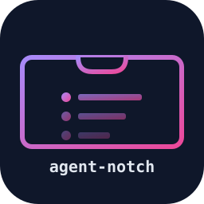

<div align="center">
  

  # agent-notch

  **Live AI coding sessions, in your MacBook Pro dynamic notch.**

  > ### ⚠️ Not maintained
  >
  > Last substantive work: May 2026. The HUD works and the code is here to read
  > or fork, but nothing new is coming: the same information is already served by
  > the [Jarvis router dashboard](https://github.com/zorahrel/jarvis-claudecode)
  > on `:3340`, and a second surface for it was not worth keeping alive.
  > The standalone mode also depended on
  > [agent-conductor](https://github.com/zorahrel/agent-conductor), archived since
  > June 2026.

  Always-on HUD over the macOS dynamic notch + menu-bar surface. Shows which sessions are awaiting your input, which are stuck on a tool call, and your top open todos — without flipping windows.

  <p>
    <a href="https://github.com/zorahrel/agent-notch/releases"></a>
    <a href="./LICENSE"></a>
    <a href="https://github.com/zorahrel/agent-notch/actions/workflows/ci.yml"></a>
    
    
    
    
  </p>
</div>

---

## What it shows

When you hover the notch, you get an expanded HUD with:

- **Sessions sidebar (right peek)** — every live AI coding agent session your machine is running. Each row shows:
  - **Outer ring colour** = provider (Claude orange-amber, Aider green, Cursor blue, ChatGPT teal-green, custom = grey)
  - **Inner dot colour** = refined status (`awaiting_user_input` orange, `tool_pending` blue, `crashed` red, `working` green, `idle` grey)
  - **Tooltip** = provider display name (e.g. "Claude Code")
  - **Click** → opens the orchestrator dashboard tab focused on that pid
- **Todo strip (thin row, top or bottom)** — top-3 open todos from your Apple Reminders list. Tap = mark complete. Long-press = reassign to a different session.
- **Aura + Orb visualisations** — voice activity feedback (driven by SSE events).
- **Live transcription bubble** — local on-device Apple speech recognition during voice input.

The notch widget is built on [DynamicNotchKit](https://github.com/MrKai77/DynamicNotchKit), the de-facto Swift API for the M3+ MacBook Pro dynamic notch.

## Why a standalone app

It started as Phase 2 of an internal multi-channel router (Jarvis). Extracted because the HUD is genuinely reusable — anyone running multiple AI coding agents in parallel benefits from a unified notch surface, regardless of which backend orchestrates the sessions. Two consumers planned:

- **Jarvis Router** — current default backend. HTTP at `localhost:3340`.
- **Topics App** — future consumer. Will run its own backend.
- **Standalone with `agent-conductor`** — *on hold.* The plan was a `watch` subcommand streaming JSON-Lines on stdout, spawned as a subprocess: zero HTTP, zero ports, zero config. [`agent-conductor`](https://github.com/zorahrel/agent-conductor) has been archived since June 2026, so that subcommand is not coming from there. The design still holds for any CLI willing to emit the same stream.

## Try it in 30 seconds (no backend required)

The fastest way to see the HUD running on your machine — no Jarvis
Router, no agent-conductor, just a small Python mock backend that
serves canned data so the sidebar + todo strip populate.

```bash
git clone https://github.com/zorahrel/agent-notch.git
cd agent-notch
./scripts/test-locale.sh
```

What the script does:

1. Verifies your Xcode toolchain (Swift 6.0 required).
2. Writes a `config.json` pointing at `http://127.0.0.1:3340`.
3. Spawns `scripts/mock-backend.py` in the background, serving 2 fake
   sessions, 3 fake todos, and a periodic `sessions:update` so the
   sidebar shows live reactivity.
4. Builds the SwiftPM target.
5. Runs `agent-notch` in the foreground.

Move your mouse to the top centre of the screen to expand the notch.
Press <kbd>Ctrl</kbd>+<kbd>C</kbd> in the terminal to stop everything
(the mock backend is killed via a shell `trap`).

If a permissions dialog appears (Microphone / Speech Recognition /
Accessibility), grant the request — without Accessibility, click-to-
expand inside the notch cutout doesn't fire (hover still works).

## Install

For a release build placed in `/Applications`:

```bash
git clone https://github.com/zorahrel/agent-notch.git
cd agent-notch
swift build -c release
cp -r .build/release/agent-notch /Applications/agent-notch
```

A signed `.app` bundle + Homebrew Cask are on the v0.2 roadmap.

### Build a real `.app` bundle

The plain-executable recipe above skips TCC usage strings, so the
first Microphone / Speech-Recognition prompt has no friendly
message, and `LSUIElement` is not set (the executable would show a
Dock icon on launch). For distribution — or just a nicer first-run
UX — use the bundler script:

```bash
./scripts/build-app.sh             # → dist/AgentNotch.app
./scripts/build-app.sh --install   # also copies into /Applications
```

The script wraps the SwiftPM output into a proper
`Contents/{MacOS,Resources}` layout, writes an `Info.plist` with
`CFBundleIdentifier`, `LSMinimumSystemVersion`, `LSUIElement = true`,
and friendly `NSMicrophoneUsageDescription` /
`NSSpeechRecognitionUsageDescription` strings, then `codesign -`
(ad-hoc) so the bundle launches locally without a Developer ID
cert. Developer-ID signing + notarization is a separate flow that
lands when the cert is in place.

## Configuration

The backend URL is read from a JSON config file:

```
~/Library/Application Support/agent-notch/config.json
```

The file is created on first launch with the defaults below. Edit it
in any text editor and relaunch — or call
`AppConfigStore.shared.update { ... }` from code to pick up the new
value live.

```json
{
  "schemaVersion": 1,
  "backendURL": "http://localhost:3340"
}
```

For back-compat the env var still wins when set:

```bash
# Override the file value (Wave 1 / scripted launches):
AGENT_NOTCH_BACKEND_URL=http://localhost:4200
```

If the config file is unreadable on startup, it is renamed to
`config.broken.<timestamp>.json` and the app falls back to the
built-in defaults — startup never crashes on a malformed file.

The backend must expose:

| Endpoint | Method | Purpose |
|---|---|---|
| `/api/notch/stream` | `GET` (SSE) | Push channel for all real-time events (sessions, todos, voice) |
| `/api/notch/send` | `POST` | Submit a user-typed message to the chat backend |
| `/api/notch/prefs` | `GET`/`POST` | Read & persist user preferences (UI density, theme) |
| `/api/notch/voice` | `POST` (multipart) | Upload an audio blob, returns transcription |
| `/api/notch/abort` | `POST` | Cancel the in-flight LLM call |
| `/api/local-sessions` | `GET` | List live AI coding sessions (drives the sidebar) |
| `/api/todos/<id>` | `GET`/`PATCH` | Read / reassign a todo |
| `/api/todos/<id>/complete` | `POST` | Mark a todo done |

Reference implementations live in [`jarvis-claudecode`](https://github.com/zorahrel/jarvis-claudecode) (router/dashboard) and the `examples/` folder of [`agent-conductor`](https://github.com/zorahrel/agent-conductor).

## Roadmap

### v0.2 — Subprocess backend (planned)

- [ ] `OrchestratorBackend` Swift class that spawns `agent-conductor watch --format json-lines` and pipes stdout into the event bus
- [ ] `NotchBackend` protocol so users can pick HTTP vs subprocess in the Preferences pane
- [ ] Drop the `AGENT_NOTCH_BACKEND_URL` env var as the only config — add a `~/Library/Application Support/agent-notch/config.json`
- [ ] Pre-built signed `.app` bundle via GitHub Releases

### v0.3 — Multi-provider chat surface

- [ ] `ChatProvider` protocol: ClaudeChatProvider, OpenAIChatProvider
- [ ] Subscription-based auth (Claude.ai web session, ChatGPT web session) — no per-token API keys required for users with a subscription
- [ ] Per-provider chat tab in the expanded notch view
- [ ] Tool exposure: `agent-conductor` primitives (`snapshot`, `inject`, `todos`) become callable tools that any chat provider can invoke through function calling / MCP

### v0.4 — Polish

- [ ] Homebrew Cask: `brew install --cask agent-notch`
- [ ] Auto-update via Sparkle
- [ ] Localisation (it, fr, de, ja, zh)
- [ ] Accessibility: VoiceOver labels for every HUD element

### Maybe-someday

- [ ] iOS companion (notch on iPhone shows the same view via Bonjour)
- [ ] System extensions for non-notch Macs (M1 / Intel / external displays) → menu-bar window equivalent
- [ ] Plug-in API: third-party views render as widgets inside the expanded notch

## Architecture

```
┌─────────────────────────────────────────────────┐
│  agent-notch.app  (this repo)                   │
│                                                 │
│   ┌──────────────────┐    ┌──────────────────┐  │
│   │  NotchController │ ←→ │   NotchEventBus  │  │
│   └────────┬─────────┘    └────────┬─────────┘  │
│            │                       │            │
│            ▼                       ▼            │
│   ┌──────────────────┐    ┌──────────────────┐  │
│   │ DynamicNotchKit  │    │  HTTP / SSE      │  │
│   │   panels +       │    │  client          │  │
│   │   SwiftUI views  │    │ (Wave 2:         │  │
│   └──────────────────┘    │  subprocess too) │  │
│                           └──────────────────┘  │
└─────────────────────────────────────────────────┘
            │                       ▲
            │                       │
            ▼                       │
  ┌─────────────────┐   HTTP / SSE  │
  │  Your backend   │ ──────────────┘
  │                 │
  │  jarvis-router  │  ← default consumer today
  │  topics-app     │  ← future consumer
  │  agent-conductor│  ← future, via subprocess (Wave 2)
  └─────────────────┘
```

## Development

```bash
git clone https://github.com/zorahrel/agent-notch.git
cd agent-notch
swift build
swift test
swift run agent-notch              # foreground run with logs
```

The notch will appear as soon as you hover the top centre of your screen. Quit via the menu-bar host or `pkill agent-notch`.

## Privacy & data

- No telemetry. No analytics. No network calls except to the backend URL you configure.
- Voice transcription is on-device (Apple's `SFSpeechRecognizer` framework).
- Audio data is only uploaded to your backend if you explicitly trigger a voice command via hover-record.
- No PII in any committed fixture or test.

## Contributing

See [CONTRIBUTING.md](./CONTRIBUTING.md). Bug reports and feature requests via [GitHub issues](https://github.com/zorahrel/agent-notch/issues).

## License

[MIT](./LICENSE)
